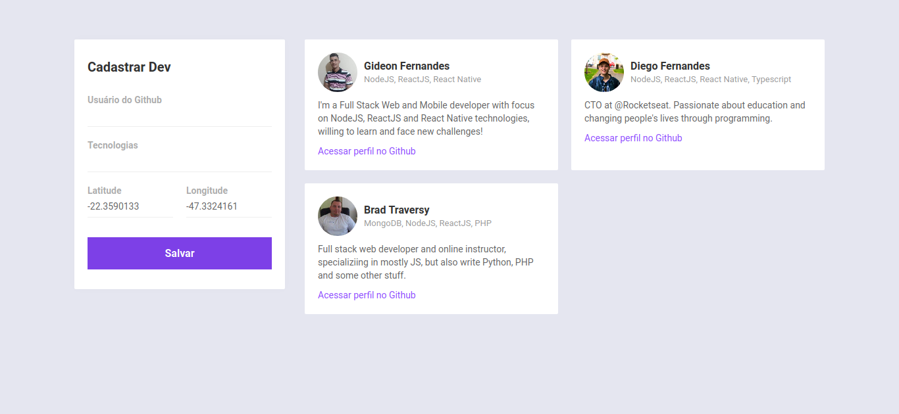

# omnistack-week-10-dev-radar

## Project

***EN:*** This project is basically an application developed to help in tracking registered developers from a radius of 10km from the user's current point, filtering them by registered technologies. It was developed for the purpose of studies and improvement of the NodeJS, ReactJS and React Native stack during the "semana omnistack 10" event provided by Rocketseat and taught by CTO Diego Fernandes.

***PT-BR:*** Este projeto é basicamente uma aplicação desenvolvida para ajudar no rastreamento de desenvolvedores cadastrados à partir de um raio de 10km do ponto atual do usuário, filtrando-os pelas tecnologias registradas. Foi desenvolvido com propósito de estudos e aprimoramento da stack NodeJS, ReactJS e React Native durante o evento "semana omnistack 10" proporcionado pela Rocketseat e ministrado pelo CTO Diego Fernandes.

This project was developed with the following technologies:

- HTML
- CSS
- ReactJS
- React Native
- Expo
- NodeJS
- Express
- MongoDB
***

## Preview Web

***

## Preview Mobile

***

### How To Install

To clone and run this application, you'll need Git, Node.js, Yarn & Expo installed on your computer.

From your command line:

#### Install DevRadar API 

```bash
# Clone this repository
$ git clone https://github.com/gideonfernandes/omnistack-week-10-dev-radar.git

# Go into the repository
$ cd omnistack-week-10-dev-radar/backend

# Install dependencies
$ yarn install

# Start server
$ yarn start

# running on port 8888
```

#### Install DevRadar Web

```bash
# Go into the repository
$ cd omnistack-week-10-dev-radar/frontend

# Install dependencies
$ yarn install

# Run
$ yarn start

# running on port 3000
```

#### Install DevRadar Mobile

```bash
# Go into the repository
$ cd omnistack-week-10-dev-radar/mobile

# Install dependencies
$ yarn install

# Run
$ yarn start

# Expo will open, just scan the qrcode on terminal or expo page
```
### License

This project is under the MIT license.
